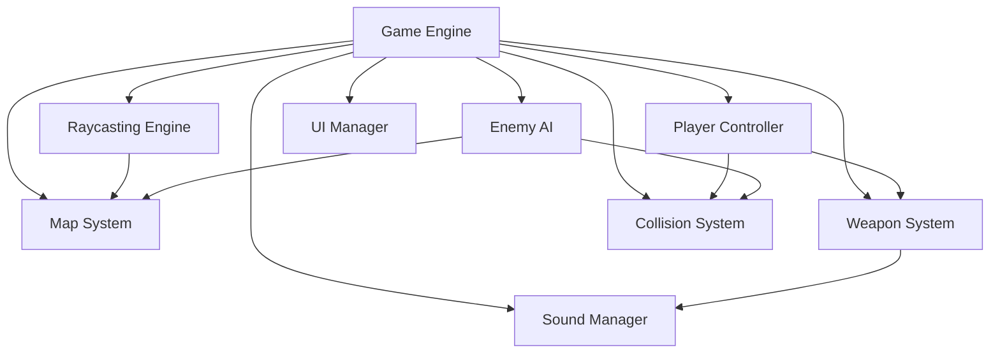

# System Patterns

## Architecture Overview
The Python Doom implementation follows a component-based game architecture using Pygame as the primary framework. The system is organized around a main game loop that handles rendering, input processing, game state updates, and collision detection. The rendering engine uses raycasting techniques to create a 3D-like environment from a 2D map.

## Key Components
- Game Engine: Core game loop and state management
- Raycasting Engine: 3D-like rendering system
- Map System: Level layout and environment data
- Player Controller: Handles player movement and actions
- Enemy AI: Controls enemy behavior and pathfinding
- Weapon System: Manages weapons, ammunition, and combat
- Sound Manager: Handles sound effects and music
- Collision System: Detects and resolves collisions
- UI Manager: Renders HUD and menus

## Component Relationships

## Design Patterns
- Game Loop Pattern: Core update-render cycle
- Component Pattern: Modular game elements with specific responsibilities
- State Pattern: Managing game states (playing, paused, menu, etc.)
- Observer Pattern: Event handling for game events
- Factory Pattern: Creating enemies and game objects
- Singleton Pattern: For managers like sound and input

## Data Flow
The game loop processes input from the player, updates the game state including player and enemy positions, checks for collisions, resolves combat, and renders the updated state to the screen. The raycasting engine takes the current player position and orientation along with the map data to render the 3D-like view of the environment.

## Key Technical Decisions
- Pygame for window management, input handling, and rendering
- Raycasting for 3D-like rendering instead of true 3D graphics
- Grid-based map system for simplified collision detection
- Component-based architecture for modularity and extensibility
- Sprite-based rendering for enemies and objects

## System Constraints
- Performance limitations of Python for real-time rendering
- Pygame's 2D rendering capabilities
- Simplified physics for better performance
- Limited AI complexity to maintain frame rate

## Future Architecture Considerations
- Potential optimization using Cython or Numba for performance-critical sections
- More sophisticated enemy AI behaviors
- Enhanced lighting and visual effects
- Expanded weapon and combat systems
- Level editor for custom map creation
