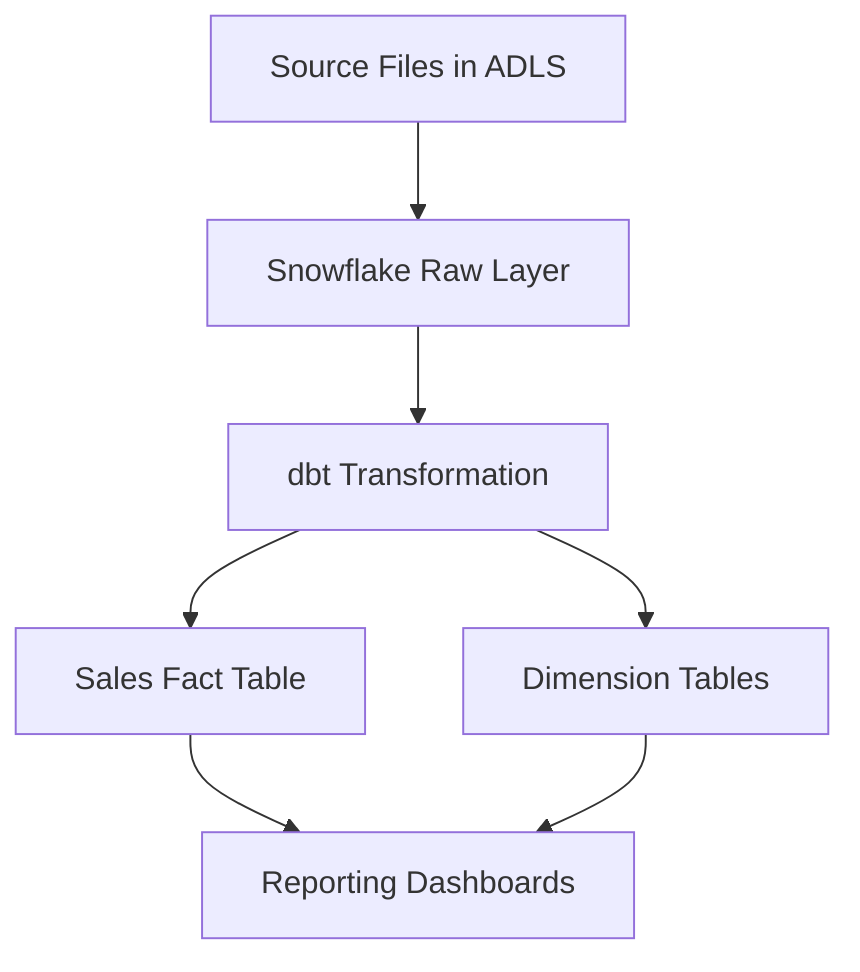

# System Patterns

## Architecture Overview
The Cline project implements a modern data warehouse architecture using Snowflake as the primary data warehouse platform. The architecture follows a standard extract, transform, load (ETL) pattern using dbt (data build tool) for transformation logic. The data model follows a star schema design with the sales fact table at the center.

## Key Components
- Azure Data Lake Storage (ADLS): Source data storage containing sales files
- Snowflake: Cloud data warehouse platform hosting the sales fact table
- dbt: Data transformation tool for building and maintaining the data models
- Sales Fact Table: Central fact table containing sales transaction data
- Dimension Tables: Supporting tables for contextual data (products, customers, time, etc.)

## Component Relationships

## Design Patterns
- Star Schema: Used for the data model with sales fact table at the center
- ELT (Extract, Load, Transform): Data is loaded into Snowflake before transformation
- Incremental Loading: Updates only new or changed data to minimize processing
- Data Vault: Potential future pattern for historical tracking

## Data Flow
Source sales data is stored as files in Azure Data Lake Storage. These files are loaded into Snowflake's raw data layer. dbt processes then transform this raw data into a properly modeled sales fact table and associated dimension tables following the star schema pattern. The goal is to complete this process within 60 minutes of the original transaction to meet the near real-time requirement.

## Key Technical Decisions
- Snowflake as data warehouse (pending final approval): Scalable, cloud-native solution
- dbt for transformations: Enables version-controlled, testable data transformations
- Star schema for data modeling: Optimized for analytical queries
- 60-minute refresh window: Balance between timeliness and system load

## System Constraints
- 60-minute data freshness requirement
- Dependency on source file availability in ADLS
- Need to maintain data consistency during transformations

## Future Architecture Considerations
- Near real-time or streaming data ingestion
- Expansion to include additional business domains
- Advanced analytics capabilities
- Data quality monitoring framework
